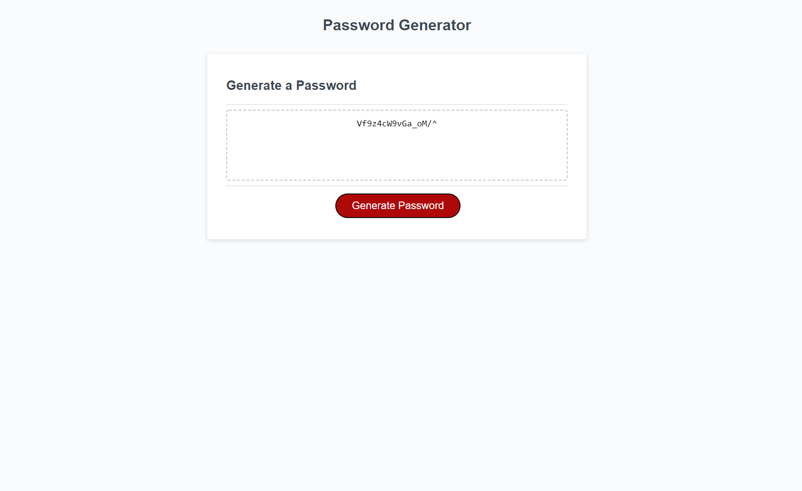

# Password Generator

## Description

In this project, I set up a password generator.

It wasn't made completely form scratch, however I had to create an algorithm that would create a randomized password, based on the length, along with the inclusion of uppercase letters, lowercase letters, numbers, and special characters.

Throughout the JS file, I included several comments that illustrate my thought process, along with how the code should funciton. The application loads without any errors.

Overall, I thought this would be a challenging project. However, after looking at how it would work, it was suprisingly easy. I enjoyed this project a lot.

**Link**

GitHub Pages: https://johnclimie.github.io/RandomPasswordGenerator/